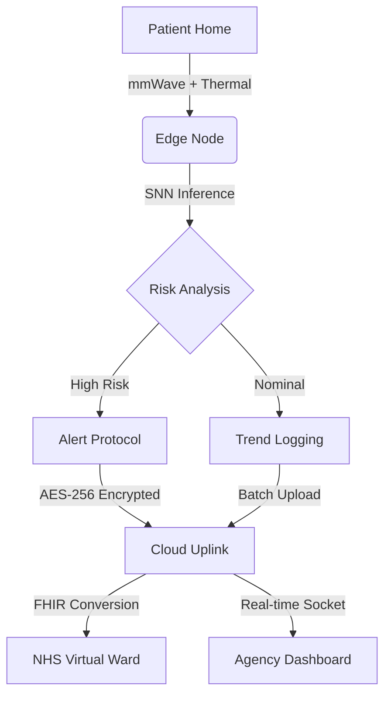

# HAKILIX CORE™: Autonomous Bio-Digital Twinning Platform


> **Principal Investigator:** Musah Shaibu (MS3)  
> **Institution:** Hakilix Labs UK Ltd  
> **Domain:** Neuromorphic Edge AI | Preventative Health | Silver Economy

---

## 📖 Executive Summary

**Hakilix Core** is a decentralized, privacy-preserving Edge AI platform designed to bridge the critical gap between independent living and clinical oversight. By fusing **4D mmWave Radar** with **Radiometric Thermal** sensing, the system creates a real-time "Bio-Digital Twin" of the resident. This enables the autonomous detection of micro-degradations in mobility (**Predictive Reablement**) without the use of invasive optical cameras.

---

## 🚀 Key Technical Innovations

### 1. Neuromorphic Edge Inference
Unlike traditional cloud-dependent AI, Hakilix runs **Leaky Integrate-and-Fire (LIF)** Spiking Neural Networks (SNNs) directly on the edge device. This mimics biological efficiency, allowing the system to process high-frequency radar data with millisecond latency and minimal power consumption.

### 2. The NHS "Home-Bridge" Engine
A proprietary interoperability layer acting as a secure translator between the home environment and clinical systems.
* **Input:** Raw unstructured sensor fusion data (JSON).
* **Process:** Edge-side noise filtering and AES-256 encryption.
* **Output:** Clinical-grade **FHIR (Fast Healthcare Interoperability Resources)** Observation objects pushed directly to NHS Virtual Ward dashboards.

### 3. Comprehensive Risk Scoring & Analytics
Includes a validated heuristic engine for calculating Fall Risk based on multi-factor analysis:
* **Gait Velocity:** Tracking speed reductions over time.
* **Time-to-Stand:** Measuring transfer capabilities.
* **Frailty Indices:** Incorporating age and history.
* **Activity Classification:** Distinguishing between walking, sleeping, and potentially dangerous behaviors like wandering.

### 4. Tactical Care Command Center
A high-density agency portal designed for 24/7 monitoring.
* **Real-time Risk Triage:** Automated sorting of patient fleet by risk level (Critical vs. Stable).
* **Live Bio-Twin Feed:** A privacy-safe 2D/3D reconstruction of patient movement.
* **Micro-Tremor Analysis:** Real-time visualization of motor control stability via WebSockets.

---

## 🛠️ System Architecture



## ⚡ Deployment & Usage

### Local Development
1.  **Install Dependencies:**
    ```bash
    pip install -r requirements.txt
    ```

2.  **Launch Backend (Cloud):**
    ```bash
    python -m backend.server
    ```
    *Server listens on `http://127.0.0.1:8080`*

3.  **Launch Edge Node (Device/Sim):**
    ```bash
    python -m edge.main
    ```
    *Simulates hardware sensor input and network conditions.*

4.  **Access Dashboard:**
    Open `http://127.0.0.1:8080` in your browser.
    * **Login:** Click "AGENCY LOGIN"
    * **Auth:** Click "AUTHENTICATE" (Demo Credentials pre-filled)

---

## 🔒 License
**Copyright © 2025 Hakilix Labs UK Ltd.**
Proprietary and Confidential. Unauthorized distribution prohibited.

**Principal Investigator:** Musah Shaibu (MS3)
**Contact:** research@hakilix.co.uk